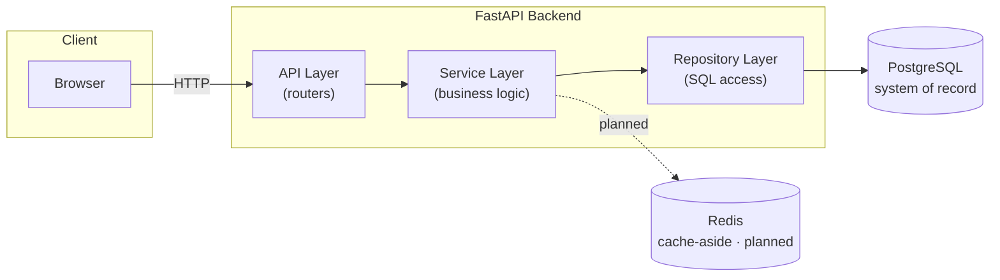
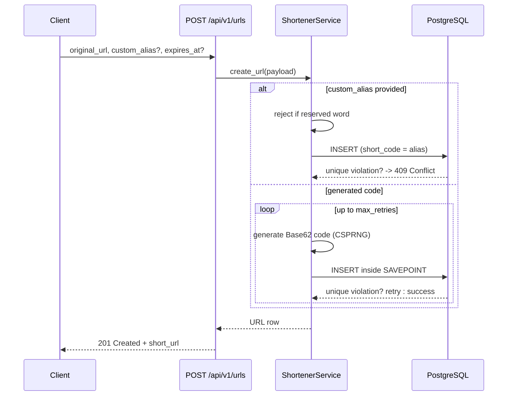
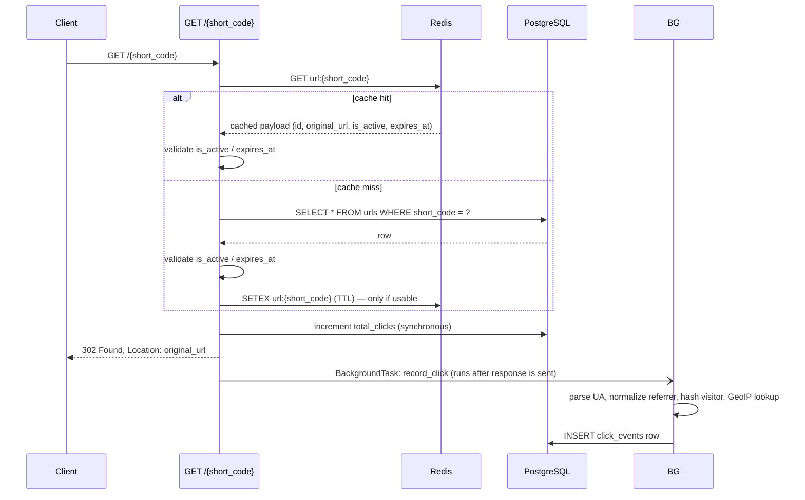
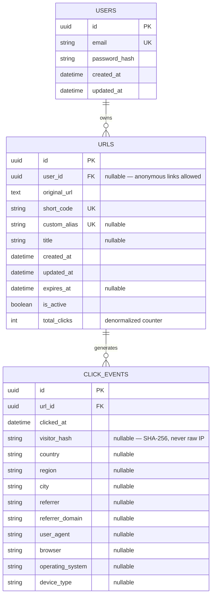
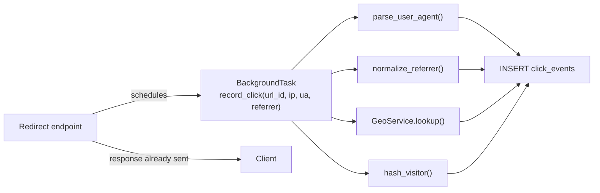

# URL Shortener & Analytics Platform

A production-style URL shortener and click-analytics platform, built the way a small SaaS product (think Bitly) would actually be engineered — not a CRUD tutorial. FastAPI + PostgreSQL + Redis on the backend, with a collision-resistant short-code generator, a cache-aside redirect path, and a React analytics dashboard.

This project is being built incrementally and documented as it goes. The sections below are marked **✅ Implemented** or **🚧 Planned** so this README never claims more than the code actually does.

## Table of Contents

- [Overview](#overview)
- [Features](#features)
- [Technology Stack](#technology-stack)
- [Architecture](#architecture)
- [Request Lifecycle](#request-lifecycle)
- [Database Schema](#database-schema)
- [Short-Code Generation & Collision Handling](#short-code-generation--collision-handling)
- [PostgreSQL Indexing](#postgresql-indexing)
- [Redis Caching](#redis-caching)
- [URL Management & QR Codes](#url-management--qr-codes)
- [Rate Limiting](#rate-limiting)
- [Authentication & Authorization](#authentication--authorization)
- [Analytics Pipeline](#analytics-pipeline)
- [Geolocation](#geolocation)
- [Referrer & Device Analytics](#referrer--device-analytics)
- [SQL Analytics](#sql-analytics)
- [Error Handling](#error-handling)
- [API Endpoints](#api-endpoints)
- [Project Structure](#project-structure)
- [Local Setup](#local-setup)
- [Docker Setup](#docker-setup)
- [Database Migrations](#database-migrations)
- [Testing](#testing)
- [Privacy Considerations](#privacy-considerations)
- [Roadmap](#roadmap)
- [Trade-offs](#trade-offs)

## Overview

A user submits a long URL and receives a short one. Visiting the short URL redirects to the original destination and records a click event for later analytics. The redirect path is the hottest, most latency-sensitive part of the system and is designed accordingly: a cache-aside Redis layer in front of PostgreSQL, with click analytics processed in the background, out of the request's critical path.

## Features

| Feature | Status |
|---|---|
| Short URL creation (`POST /api/v1/urls`) | ✅ |
| Base62 short codes, CSPRNG-generated | ✅ |
| Collision-resistant generation (retry on DB unique-constraint conflict) | ✅ |
| Custom aliases with reserved-word protection | ✅ |
| Link expiration (`expires_at`) | ✅ |
| Enable/disable links (`is_active`) | ✅ |
| Redirect engine (`GET /{short_code}`, HTTP 302) | ✅ |
| Consistent JSON error envelope | ✅ |
| Structured logging | ✅ |
| Health endpoint (`GET /health`, checks Postgres + Redis independently) | ✅ |
| Alembic migrations (no `create_all()` in production) | ✅ |
| Dockerized Postgres + Redis + backend, with healthchecks | ✅ |
| Automated tests (pytest) for creation, collisions, expiry/disable | ✅ |
| Redis cache-aside layer for redirects (hit/miss/TTL, Redis-outage fallback) | ✅ |
| Click analytics pipeline (background processing via FastAPI BackgroundTasks) | ✅ |
| Referrer normalization and User-Agent (browser/OS/device) parsing | ✅ |
| IP geolocation (MaxMind GeoLite2, graceful no-op if unconfigured) | ✅ |
| Analytics API + SQL aggregation (`GET /api/v1/urls/{id}/analytics`) | ✅ |
| JWT authentication (register/login/me) | ✅ |
| Per-user URL ownership & authorization (list/view/analytics restricted to owner) | ✅ |
| Edit (`PATCH`) / delete (`DELETE`) URLs, with cache invalidation on change | ✅ |
| QR code generation (`GET /api/v1/urls/{id}/qr`) | ✅ |
| Redis-backed rate limiting, scoped per endpoint class | ✅ |
| React analytics dashboard | 🚧 |
| Load testing (Locust/k6) | 🚧 |

## Technology Stack

**Backend:** Python 3.12, FastAPI, SQLAlchemy 2.x, Pydantic v2, Alembic, PostgreSQL 16, Redis 7, pytest.

**Frontend (planned):** React, TypeScript, Vite, Tailwind CSS, React Router, TanStack Query, Recharts.

**Infrastructure:** Docker, Docker Compose, environment-variable configuration.

## Architecture



The backend follows a layered architecture: **routers** (`api/`) handle HTTP concerns only, **services** (`services/`) hold business logic (short-code generation, validation rules), and **repositories** (`repositories/`) isolate SQLAlchemy query-building so services stay testable without a real database query in every unit test.

## Request Lifecycle

### Create a short URL (implemented)



### Redirect (cache-aside, implemented)



If Redis is unreachable, every `CacheService` call catches `RedisError`, logs a warning, and returns as if it were a cache miss — the endpoint falls straight through to PostgreSQL. Redis is never a second system of record; a total Redis outage degrades the redirect path's latency, not its correctness.

**Why HTTP 302, not 301:** a short link's destination can be edited, disabled, or expire. A 301 (Moved Permanently) invites browsers to cache the redirect indefinitely and skip the server entirely on repeat visits — silently breaking both editability and click counting. 302 keeps every click live.

## Database Schema



`users.id` is currently nullable-foreign-keyed from `urls` — anonymous link creation is allowed today since authentication isn't implemented yet (Phase 5). Once auth lands, the API layer will attach `user_id` for logged-in requests without a schema change.

`urls.total_clicks` is a denormalized counter, updated alongside each redirect. It exists so a "list my URLs" view never has to run `COUNT(*)` over `click_events` for every row — the detailed, filterable analytics still come from `click_events` itself.

## Short-Code Generation & Collision Handling

Codes are 7-character Base62 strings (`0-9`, `a-z`, `A-Z`), generated with Python's `secrets` module — a CSPRNG, not `random`, so codes aren't predictable or enumerable by an attacker who has observed other codes.

**Namespace:** 62⁷ ≈ 3.5 trillion combinations. Collisions are rare at that scale but not impossible, so the database — not an application-level existence check — is the source of truth for uniqueness:

1. Generate a candidate code.
2. Attempt `INSERT` inside a `SAVEPOINT`.
3. If PostgreSQL raises a unique-constraint violation, roll back **only that savepoint** and retry with a new code (`SHORT_CODE_MAX_RETRIES`, default 5).
4. If retries are exhausted, fail loudly and log it — this is treated as an abnormal event, not silently swallowed.

Using a `SAVEPOINT` per attempt (rather than a full `session.rollback()`) matters: a bare rollback on collision would discard *any other pending work* on that database session, not just the failed insert. This was caught by a test (`test_collision_triggers_retry_and_eventually_succeeds`) during development and fixed before merging.

Custom aliases skip the retry loop entirely — a duplicate alias is a genuine conflict (`409`), not something to silently paper over with a different code, since the user chose that alias deliberately.

## PostgreSQL Indexing

| Index | Query it serves | Column order rationale |
|---|---|---|
| `urls.short_code` (unique) | Redirect lookup: `WHERE short_code = ?` | Single column, enforces uniqueness and gives O(log n) lookup on the hottest read path in the system. |
| `urls.custom_alias` (unique) | Alias-uniqueness check on create | Enforced at the DB level so concurrent alias claims can't both succeed. |
| `ix_urls_user_id_created_at (user_id, created_at)` | "My links, newest first" — the dashboard's main list query | `user_id` leads because it's always an equality filter; `created_at` second lets Postgres satisfy `ORDER BY created_at DESC` from the index without a separate sort. |
| `ix_click_events_url_id_clicked_at (url_id, clicked_at)` | "Clicks for URL X between date A and B" — every analytics query | Same reasoning: `url_id` is always the equality filter, `clicked_at` supports the date-range scan and ordering. |
| `click_events.referrer_domain` | Top-referrers aggregation (Phase 4) | Supports `GROUP BY referrer_domain` without a full table scan. |

**Trade-off:** every index speeds up its target query but costs extra write time and storage on every `INSERT`. `click_events` is a high-write table (one row per redirect), so indexes on it are deliberately limited to the two access patterns actually needed — no indexing "just in case."

Once traffic-representative data exists, `EXPLAIN ANALYZE` output for the redirect lookup and the analytics range query will be added here rather than guessed at.

## Redis Caching

Cache-aside, implemented in `app/services/cache_service.py` and wired into `GET /{short_code}`.

- **Key:** `url:{short_code}`
- **Value:** a small JSON payload — `id`, `original_url`, `is_active`, `expires_at` — deliberately not the full row (no `title`, `user_id`, etc.), since those fields are never needed to serve a redirect.
- **TTL:** `REDIRECT_CACHE_TTL_SECONDS` (default 3600s / 1 hour).
- **Population:** only on a cache miss, and only for links that pass `is_link_usable()` — an expired or disabled link is never written to the cache, so a bad entry can't outlive its own validity check.
- **Validation on every hit:** the cached `is_active`/`expires_at` are re-checked on every request, not trusted blindly. This bounds the "stale cache" risk within the TTL window even before any explicit invalidation.
- **Invalidation:** `PATCH /api/v1/urls/{id}` and `DELETE /api/v1/urls/{id}` both call `CacheService.invalidate()` immediately after committing the change — a link disabled or deleted stops resolving on the very next request, rather than waiting out the TTL. Verified with a live test: warm the cache, disable the link, confirm the Redis key is gone *and* the next redirect returns 410.
- **Failure mode:** every `CacheService` method catches `redis.RedisError` internally and returns/no-ops rather than raising. A Redis outage means every request pays a full Postgres round-trip (cache-miss cost, permanently) — slower, never broken.

**Why cache-aside over a write-through or read-through cache:** the redirect path reads far more than it writes (one `INSERT` per link creation, many `GET`s per link over its lifetime), and Postgres must remain authoritative regardless of Redis's state — cache-aside is the standard fit for that access pattern and keeps Redis strictly optional.

## URL Management & QR Codes

All under `app/api/v1/urls.py`, owner-only (via `get_current_user` + an ownership check shared by every route as `_get_owned_url`):

- **`PATCH /api/v1/urls/{id}`** — partial update. Uses Pydantic's `exclude_unset=True` so only fields actually present in the request body are applied; omitting `is_active` from the payload can never accidentally flip it back on. Any actual change invalidates the cache entry (see above).
- **`DELETE /api/v1/urls/{id}`** — hard delete (cascades to that URL's `click_events` via the FK's `ondelete="CASCADE"`), `204 No Content`, and invalidates the cache entry so the short code stops resolving immediately rather than continuing to serve from a stale cache until TTL.
- **`GET /api/v1/urls/{id}/qr`** — a PNG QR code encoding the link's short URL, generated on demand (`qrcode` library) rather than precomputed and stored at creation time. Most links are never viewed as a QR code, so generating on request avoids doing that work for every single `POST /api/v1/urls` call.

## Rate Limiting

Redis-backed, fixed-window, implemented in `app/services/rate_limit_service.py` (the algorithm) and `app/middleware/rate_limit.py` (the per-endpoint FastAPI dependencies).

**Algorithm:** `INCR` a counter keyed by `ratelimit:{scope}:{identifier}`; on the first hit in a window, `EXPIRE` it to the window length; once the count exceeds the limit, reject with `429` and `Retry-After` set to the key's remaining TTL. State lives in Redis, not process memory, so the limit holds correctly across multiple backend instances behind a load balancer — a requirement the README's own architecture section anticipates. **Trade-off vs. alternatives:** fixed window is simple and cheap (one `INCR`, one conditional `EXPIRE`), but it can let roughly 2x the nominal limit through across a window boundary (a burst at the end of one window plus a burst at the start of the next). A sliding-window-log (a Redis sorted set of timestamps) or token-bucket (continuous refill, controlled bursts) algorithm avoids that at the cost of more Redis state and computation per check. For anti-abuse limits at this project's scale, bounding worst-case abuse to ~2x the stated number is the right trade for the simpler implementation.

**Scopes** (each independently configurable via `.env`, `count/window_seconds`):

| Scope | Default | Keyed by | Applied to |
|---|---|---|---|
| Anonymous URL creation | 10/hour | Client IP | `POST /api/v1/urls` (no auth) |
| Authenticated URL creation | 100/hour | User id | `POST /api/v1/urls` (with auth) — deliberately a *separate* bucket from the anonymous limit, verified by a test that exhausts the anonymous quota and confirms an authenticated request from the same client still succeeds |
| Login | 10/5 min | Client IP | `POST /api/v1/auth/login` — brute-force protection |
| Analytics reads | 120/min | Client IP | `GET /api/v1/urls/{id}/analytics` |
| Redirects | 300/min | Client IP | `GET /{short_code}` |

**Fails open:** any `RedisError` during a check allows the request through rather than rejecting it — an outage in the rate limiter must not become an outage of the product itself (same fail-soft principle as `CacheService`).

Verified live: hammering `POST /api/v1/auth/login` with wrong credentials returns `401` for the first 10 attempts, then `429` with a correct `Retry-After` header from the 11th attempt onward, within the configured 5-minute window.

## Authentication & Authorization

JWT-based, implemented in `app/core/security.py` (hashing/tokens), `app/core/deps.py` (request-level auth dependencies), and `app/services/auth_service.py` (registration/login business logic).

- **Passwords** are hashed with bcrypt (`passlib`), never stored or logged in plaintext.
- **`POST /api/v1/auth/register`** creates a user; a duplicate email returns `409 Conflict` (via the same SAVEPOINT-per-insert pattern used for short-code collisions — a conflict must only undo its own insert, not other pending work on the session).
- **`POST /api/v1/auth/login`** verifies the password and returns a JWT (`HS256`, `ACCESS_TOKEN_EXPIRE_MINUTES` default 60). Wrong password and nonexistent email return the *same* `401` message — a distinct error would let an attacker enumerate registered emails.
- **`GET /api/v1/auth/me`** returns the caller's own profile; requires a valid bearer token.
- **Two auth dependencies**, used per-endpoint depending on whether anonymous access is meaningful there:
  - `get_current_user` — **required**. No/invalid/expired token → `401`. Used by `GET /api/v1/urls` (list mine) and `GET /api/v1/urls/{id}`.
  - `get_current_user_optional` — **optional**. No `Authorization` header at all → `None` (anonymous). A header that *is* present but invalid → still `401`, deliberately: silently downgrading a bad token to "anonymous" would hide a client-side auth bug instead of surfacing it. Used by `POST /api/v1/urls` (anonymous creation stays supported) and the analytics endpoint.
- **Ownership rule** (`POST /api/v1/urls`, `GET /api/v1/urls/{id}`, `GET /api/v1/urls/{id}/analytics`): a URL created while authenticated is attributed to that user (`urls.user_id`) and only that user can view its detail or analytics — everyone else, including anonymous callers, gets `403`. A URL created **without** auth has no owner (`user_id IS NULL`) and its analytics remain publicly readable by short_code, matching how it could be created in the first place. Verified with live cross-account tests: a second user attempting to read the first user's URL or analytics gets `403`; no token at all on a protected endpoint gets `401`.

## Analytics Pipeline

Every redirect schedules a `record_click` **FastAPI `BackgroundTask`** (`app/services/click_recording_service.py`), which runs only *after* the redirect response has already been sent to the client:



- **Why BackgroundTasks and not Celery/Kafka:** the redirect response must not wait on UA parsing, GeoIP lookups, or a second database write — but at this project's scale, a full message broker would be unjustified complexity. `BackgroundTasks` gets the same "don't block the response" property for free, in-process.
- **Scale-out path:** if click volume outgrew a single process's background-task capacity, the natural evolution is `Redirect Service → Event Queue (Kafka/SQS/Redis Streams) → Analytics Workers → Analytics Database` — decoupling ingestion from processing and allowing horizontal worker scaling. Not implemented here; documented because the interview question always comes up.
- **`total_clicks` stays synchronous:** it's a single indexed-PK update, cheap enough to not need deferring, and it's the one number a URL's detail view needs immediately (e.g., right after creating a link and sharing it).
- **Failure handling:** `record_click` opens its own DB session (the request-scoped one is already closed by the time it runs) and wraps everything in a broad `try/except` — any failure (bad GeoIP data, a transient DB error) is logged via `logger.exception` and swallowed. An analytics failure must never crash the process or surface to the visitor who was just redirected.

## Geolocation

`GeoService` (`app/services/geo_service.py`) wraps a local [MaxMind GeoLite2](https://dev.maxmind.com/geoip/geolite2-free-geolocation-data) City database (free, requires a MaxMind account to download — not bundled in this repo).

- If `GEOIP_DATABASE_PATH` doesn't point to an existing file, `GeoService` logs it once at startup and every `lookup()` call returns `(None, None, None)` — geolocation degrades to "unavailable," never to a crash. This is the current state of this repo (no database file is committed).
- To enable it locally: download `GeoLite2-City.mmdb` from MaxMind and place it at the path in `.env`'s `GEOIP_DATABASE_PATH`, then restart the backend.
- **Accuracy is inherently approximate.** VPNs, corporate proxies, mobile carrier NAT, and ISP routing all mean the resolved IP frequently isn't near the visitor's actual location — this is a limitation of IP geolocation in general, not of this implementation.

## Referrer & Device Analytics

- **Referrer normalization** (`app/utils/referrer.py`): the raw `Referer` header is parsed for its hostname, `www.` is stripped, and a small map folds known-provider subdomains (`l.facebook.com`, `m.facebook.com`, `google.co.uk`, `t.co`, …) onto one canonical name (`facebook.com`, `google.com`, `x.com`) so "top referrers" isn't fragmented across near-duplicate rows. No `Referer` header at all normalizes to `"Direct/Unknown"`.
- **User-Agent parsing** (`app/utils/user_agent.py`): uses the maintained `user-agents` library rather than a hand-rolled regex parser (UA strings are a notoriously messy, ever-shifting format). Extracts `browser`, `operating_system`, and buckets `device_type` into `Desktop` / `Mobile` / `Tablet` / `Bot` / `Other`.

## SQL Analytics

All aggregation happens in PostgreSQL (`app/repositories/click_event_repository.py`), never by pulling every `click_events` row into Python:

| Metric | Query shape |
|---|---|
| Total clicks | `COUNT(*) WHERE url_id = ?` |
| Unique visitors (approximate) | `COUNT(DISTINCT visitor_hash) WHERE url_id = ? AND visitor_hash IS NOT NULL` |
| Clicks today | `COUNT(*) WHERE url_id = ? AND clicked_at >= <today, UTC>` |
| Clicks over time | `SELECT date_trunc('day', clicked_at), COUNT(*) ... GROUP BY 1 ORDER BY 1` |
| Top countries / cities / referrers / browsers / OS / devices | `SELECT <column>, COUNT(*) ... GROUP BY <column> ORDER BY COUNT(*) DESC LIMIT 5`, column `IS NOT NULL` |

All of the above accept an optional `[start, end]` UTC range, applied as `clicked_at >= start` / `clicked_at <= end` — which is exactly what `ix_click_events_url_id_clicked_at` (see [PostgreSQL Indexing](#postgresql-indexing)) is built to serve efficiently: an index range scan on the leading `url_id` equality plus the `clicked_at` range, with no separate sort needed for the time-series query.

## Error Handling

All application errors return a consistent envelope instead of a stack trace:

```json
{ "error": { "code": "not_found", "message": "Short link not found." } }
```

| Scenario | HTTP status | `error.code` |
|---|---|---|
| Short code doesn't exist | 404 | `not_found` |
| Link expired or disabled | 410 | `gone` |
| Custom alias already taken | 409 | `conflict` |
| Custom alias is a reserved word | 422 | `validation_error` |
| Invalid `original_url` (bad scheme, malformed) | 422 | `validation_error` |
| Email already registered | 409 | `conflict` |
| Missing/invalid/expired auth token | 401 | `unauthorized` |
| Wrong password / unknown email at login | 401 | `unauthorized` |
| Authenticated but not the resource's owner | 403 | `forbidden` |
| Rate limit exceeded | 429 | `rate_limited` (with `Retry-After` header) |
| Unhandled server error | 500 | `internal_error` (no internals leaked) |

## API Endpoints

| Method | Path | Auth | Rate limit | Description |
|---|---|---|---|---|
| `POST` | `/api/v1/auth/register` | — | — | Create a user account. |
| `POST` | `/api/v1/auth/login` | — | 10/5min per IP | Exchange email/password for a JWT. |
| `GET` | `/api/v1/auth/me` | required | — | Current user's profile. |
| `POST` | `/api/v1/urls` | optional | 10/hr anon · 100/hr auth | Create a short URL. Attributed to the caller if authenticated, anonymous otherwise. |
| `GET` | `/api/v1/urls` | required | — | List the authenticated user's URLs. |
| `GET` | `/api/v1/urls/{id}` | required | — | View one URL's detail. 403 if you're not the owner. |
| `PATCH` | `/api/v1/urls/{id}` | required | — | Partial update (title/expiry/active). Owner-only; invalidates the cache. |
| `DELETE` | `/api/v1/urls/{id}` | required | — | Delete a URL. Owner-only; invalidates the cache. |
| `GET` | `/api/v1/urls/{id}/qr` | required | — | PNG QR code for the URL's short link. Owner-only. |
| `GET` | `/{short_code}` | — | 300/min per IP | Resolve and redirect (302) to the original URL; schedules background click recording. |
| `GET` | `/api/v1/urls/{id}/analytics` | optional | 120/min per IP | Aggregated click analytics. Optional `start_date`/`end_date` (UTC, inclusive). Public for anonymously-created URLs; owner-only otherwise. |
| `GET` | `/health` | — | — | Liveness/readiness — reports PostgreSQL and Redis status independently. |
| `GET` | `/docs` | — | — | Interactive Swagger/OpenAPI documentation. |

Full interactive docs are available at `http://localhost:8000/docs` once the backend is running.

## Project Structure

```
url-shortener/
├── backend/
│   ├── app/
│   │   ├── main.py              # FastAPI app, middleware, router/exception wiring
│   │   ├── api/v1/               # Routers — HTTP layer only
│   │   ├── core/                 # Config, DB session, Redis client, logging, exceptions
│   │   ├── models/                # SQLAlchemy ORM models
│   │   ├── schemas/               # Pydantic request/response models
│   │   ├── services/              # Business logic (short-code generation, validation)
│   │   ├── repositories/          # SQL query access, isolated from business logic
│   │   ├── middleware/            # (planned: rate limiting)
│   │   ├── utils/                 # Base62 generation, reserved-alias list
│   │   └── tests/                 # pytest suite
│   ├── alembic/                   # Migration environment + versions
│   ├── requirements.txt
│   └── Dockerfile
├── frontend/                      # (planned — Phase 7)
├── docker-compose.yml
├── .env.example
└── README.md
```

## Local Setup

Requires Docker (or a Docker-compatible runtime such as [Colima](https://github.com/abiosoft/colima) on macOS) and Docker Compose.

```bash
git clone https://github.com/mahadabbasi19/URL-Shortner-Analytics.git
cd URL-Shortner-Analytics
cp .env.example .env

# Start Postgres + Redis + backend
docker compose up -d postgres redis backend

# Migrations run automatically on backend startup (see docker-compose.yml).
# Verify:
curl http://localhost:8000/health
```

## Docker Setup

`docker-compose.yml` defines four services (`frontend` is a placeholder until Phase 7):

- **postgres** — Postgres 16, persisted via a named volume, with a `pg_isready` healthcheck.
- **redis** — Redis 7, with a `redis-cli ping` healthcheck.
- **backend** — builds from `backend/Dockerfile`, waits for both dependencies to report healthy, runs `alembic upgrade head`, then starts `uvicorn --reload`.
- **frontend** — reserved for the Phase 7 React app.

No secrets are baked into the image or compose file — everything comes from `.env` (copy `.env.example` and edit for local dev; never commit a real `.env`).

## Database Migrations

Schema changes are managed exclusively through Alembic — the app never calls `Base.metadata.create_all()` in production. To create a new migration after changing a model:

```bash
docker compose exec backend alembic revision --autogenerate -m "describe the change"
docker compose exec backend alembic upgrade head
```

The initial migration (`4909c0ae0e73`) creates `users`, `urls`, and `click_events` with all indexes and constraints described above, and has been verified to apply cleanly to an empty database.

## Testing

```bash
docker compose exec backend pytest app/tests/ -v
```

Current coverage (77 tests):
- **Shortener:** creation with a generated code, custom-alias creation, reserved-alias rejection, duplicate-alias conflict, collision retry (mocked to force two collisions before success), retry exhaustion, resolution for missing/expired/disabled links.
- **Cache:** set/get round-trip, miss, invalidate, TTL is applied correctly, graceful fallback when Redis raises on GET or SETEX, corrupt cache entries are ignored rather than crashing.
- **Redirect (integration, via `TestClient`):** cache populated on miss and served on hit, `total_clicks` increments on both paths, 404 for missing codes, 410 for expired/disabled links (and confirms they're never cached), and a full request succeeds even when Redis is unreachable.
- **Referrer / User-Agent / visitor-hash utilities:** domain normalization and canonical-provider mapping, browser/OS/device-type extraction for desktop/mobile/bot UAs, hash determinism and day-rotation.
- **Click recording:** `record_click` writes a correctly-populated `click_events` row, and a failure (e.g. a foreign-key violation) is logged and swallowed rather than raised.
- **Analytics:** SQL aggregation correctness (total/unique/top-N/date-filtering) at the service layer, `404` for a nonexistent URL, and a full redirect → background-task → analytics-query round trip confirming the whole pipeline end to end.
- **Auth:** registration (including duplicate-email conflict and password-length validation), login (correct/wrong password, unknown email), `/me` with no/garbage/valid tokens.
- **Authorization:** anonymous creation still works; authenticated creation attaches ownership and shows up in "my URLs"; a second user gets 403 on another user's URL detail and analytics; anonymous URLs' analytics stay publicly readable; unauthenticated callers get 401 on owner-only endpoints. Also verified live against the running stack with two real accounts.
- **URL management:** owner can disable/edit/delete their own URL; a non-owner gets 403 on update, delete, and QR generation; disabling or deleting immediately invalidates the Redis cache (verified by warming the cache, mutating the URL, and confirming both the cache key is gone *and* the next redirect reflects the change) rather than waiting out the TTL; QR endpoint returns a real PNG (magic-byte checked).
- **Rate limiting:** allowed-within-limit, blocked-once-exceeded, resets after the window elapses, fails open on a Redis error, a real `429` from the login endpoint with a tight limit override, and anonymous/authenticated creation quotas are confirmed to be independent buckets.

Tests run against the same PostgreSQL instance as local dev, each wrapped in an outer transaction (`join_transaction_mode="create_savepoint"`) that's rolled back afterward — so application code under test can call `db.commit()` freely (as the redirect endpoint does) without any of it surviving past the test. The `client` fixture (in `conftest.py`, shared by every test module) always overrides both `get_db` *and* `get_redis` with the test's isolated, per-test-flushed instances — a lesson learned during this phase, when a rate-limit test suite exposed that a couple of test files had been overriding only `get_db`, letting their requests hit the real, unflushed Redis connection and silently share rate-limit counters with unrelated tests.

## Privacy Considerations

- **Raw IP addresses are never persisted.** The IP seen by the redirect handler is used only in-memory, for two purposes: a GeoIP lookup (to resolve country/region/city) and computing `visitor_hash`. The IP itself never reaches the `click_events` table.
- **`visitor_hash`** is `SHA-256(ip + "|" + user_agent + "|" + today's date)` (`app/utils/visitor_hash.py`). It exists solely to approximate unique-visitor counts via `COUNT(DISTINCT visitor_hash)`. Rotating the salt by calendar day means the same visitor gets a *different* hash tomorrow — it's not designed to be a durable cross-session identifier, and it can't be reversed back to an IP.
- **Geolocation resolves to city-level, at most** — never a precise coordinate — and is approximate by nature (see [Geolocation](#geolocation)).
- **`user_agent`** (the full raw string) is stored as-is for debugging/parsing-improvement purposes; it's not linked to any account identity in the schema, since `click_events` has no `user_id`.
- **No third-party analytics/tracking scripts** are involved — all analytics are first-party, computed from the server's own request handling.

## Roadmap

The remaining phases, in build order:

1. **React dashboard** — landing page, auth flows, link management, analytics visualizations.
2. **Quality pass** — load testing (Locust/k6) comparing cache-hit vs. cache-miss latency, `docs/system-design.md`, final end-to-end verification.

Each phase is verified (migrations run, tests pass, manual smoke test) before moving to the next, and this README is updated alongside the code rather than after the fact.

## Trade-offs

- **FastAPI `BackgroundTasks` over Kafka/Celery for analytics** (planned): the redirect response should not wait on analytics enrichment, but a full message queue is unjustified complexity at this stage. The upgrade path (`Redirect Service → Event Queue → Analytics Workers`) is documented for when volume actually demands it.
- **Denormalized `total_clicks` on `urls`** alongside the authoritative `click_events` table: a small consistency/write-cost trade for avoiding a `COUNT(*)` on every dashboard list render.
- **Anonymous URL creation is allowed** (`urls.user_id` is nullable): matches how Bitly-style tools actually work — auth is additive, not a hard requirement to use the core product.
